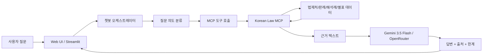
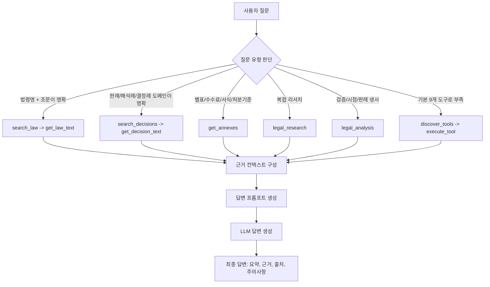
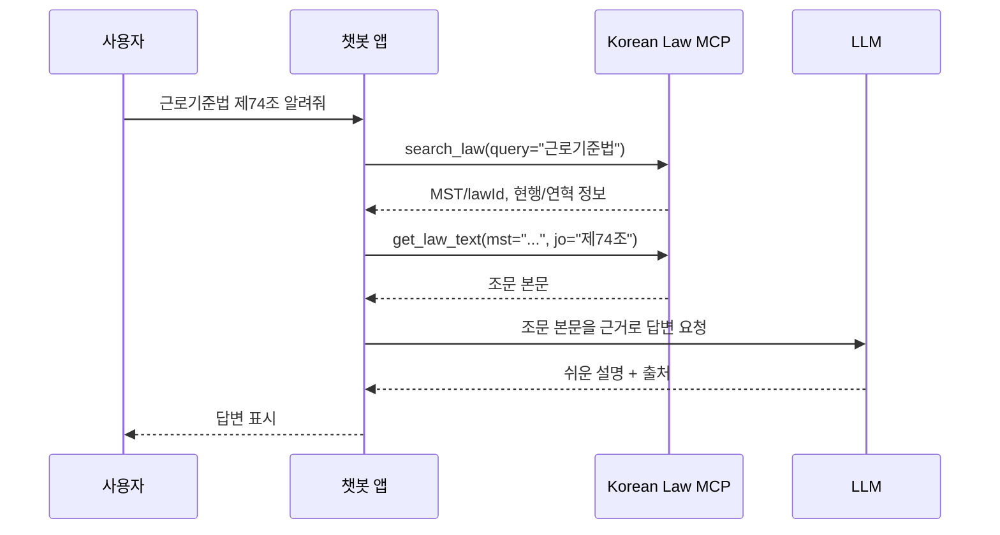
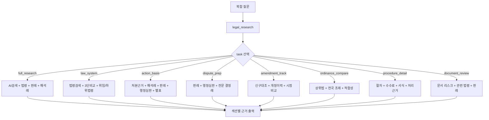
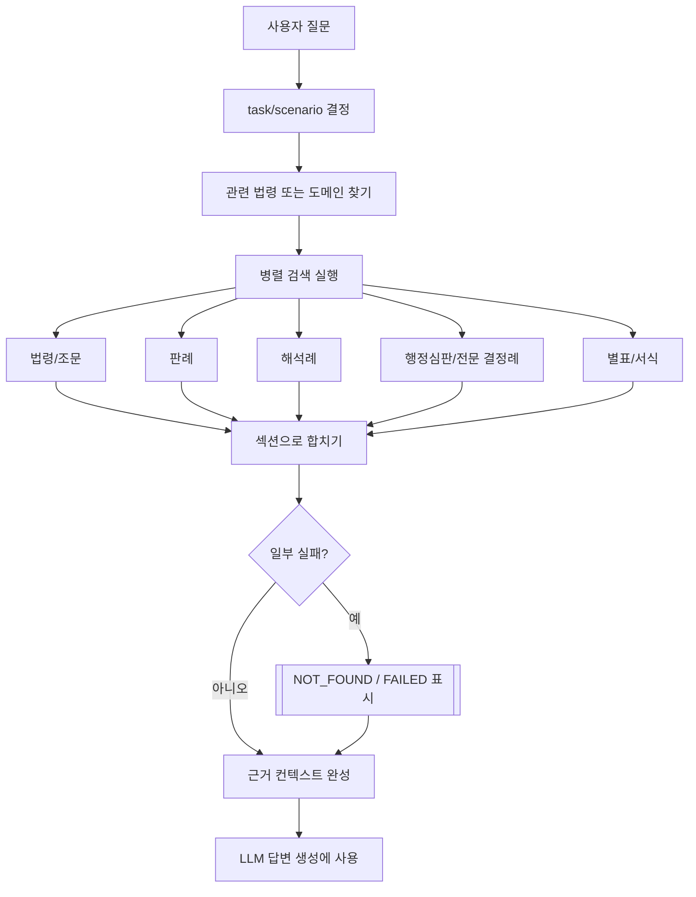
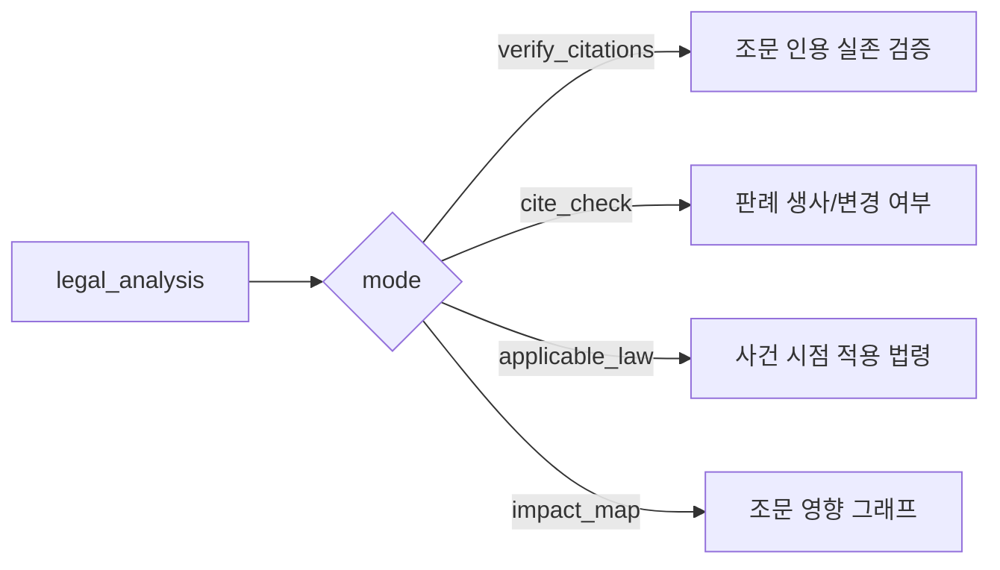
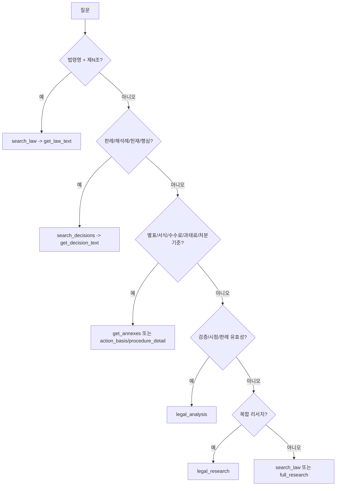
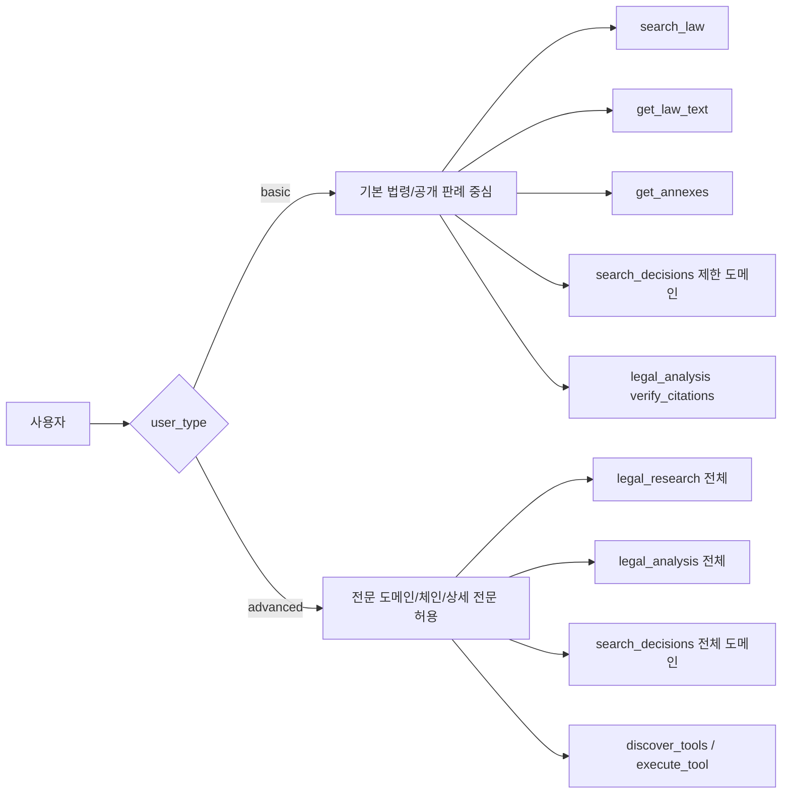

# Korean Law MCP 사용 설계 가이드

이 문서는 `onelineai-test`에서 `korean-law-mcp`를 법률 RAG 챗봇의 검색/근거 수집 계층으로 사용하는 방법을 설명한다. 초점은 MCP 서버 내부 구현이 아니라, 챗봇이 어떤 질문에서 어떤 MCP 도구를 호출하고, 체인 도구를 언제 쓰며, 결과를 어떻게 답변과 출처로 연결할지에 있다.

분석 기준: `korean-law-mcp` v4.4.2.

## 1. 이 MCP를 어떻게 바라볼 것인가

`korean-law-mcp`는 법률 챗봇 입장에서 "법률 데이터 검색 엔진 + 근거 수집 도구 모음"이다.

LLM은 법률 지식을 기억으로 답하려고 하면 오래된 법령, 존재하지 않는 조문, 잘못된 판례를 말할 수 있다. 그래서 챗봇은 먼저 MCP로 법령/판례/해석례/별표를 조회하고, 그 결과를 근거로 답변을 작성해야 한다.



핵심 원칙은 간단하다.

1. 질문을 바로 LLM에게 넘기지 않는다.
2. 먼저 MCP로 근거를 찾는다.
3. MCP 결과 안에 있는 법령명, 조문, 판례 ID, 시행일, `[NOT_FOUND]` 같은 신호를 보존한다.
4. LLM은 "찾은 자료만 근거로" 답한다.
5. 못 찾은 부분은 못 찾았다고 말한다.

## 2. 사용 관점의 전체 구조

이 프로젝트에서 추천하는 사용 구조는 다음과 같다.



여기서 MCP는 답변을 완성하는 도구가 아니라, 답변 재료를 정확히 가져오는 도구다. 최종 답변은 앱의 오케스트레이터가 MCP 결과와 대화 이력을 LLM에 넣어 생성한다.

## 3. MCP의 9개 기본 도구

현재 MCP 클라이언트에 노출되는 도구는 9개다.

| 도구 | 한 줄 설명 | 챗봇에서 쓰는 위치 |
|---|---|---|
| `search_law` | 법령명 검색. `mst`, `lawId`를 얻는다. | 거의 모든 법령 조회의 첫 단계 |
| `get_law_text` | 법령 전문 또는 특정 조문 조회 | 사용자가 조문을 물을 때 |
| `get_annexes` | 별표, 별지, 서식, 수수료표, 처분기준표 조회 | 금액/기준/양식 질문 |
| `search_decisions` | 판례, 해석례, 조세심판, 헌재 등 18개 도메인 검색 | 사건/판례/결정례 검색 |
| `get_decision_text` | 검색된 판례/결정례 본문 조회 | 상세 근거 확보 |
| `legal_research` | 여러 도구를 묶어 실행하는 리서치 체인 | 복합 질문 처리 |
| `legal_analysis` | 인용검증, 판례 생사, 행위시법, 영향 그래프 | 검증/분석 질문 |
| `discover_tools` | 숨겨진 전문 도구 찾기 | 고급 사용자/관리자용 |
| `execute_tool` | 숨겨진 전문 도구 실행 | 고급 사용자/관리자용 |

## 4. 가장 기본적인 사용 패턴

### 4.1 법령 조문 조회

사용자가 "근로기준법 제74조 알려줘"처럼 법령명과 조문을 말하면 가장 단순한 2단계가 좋다.



사용 예:

```json
{
  "tool": "search_law",
  "arguments": {
    "query": "근로기준법"
  }
}
```

그 다음:

```json
{
  "tool": "get_law_text",
  "arguments": {
    "mst": "검색 결과의 MST",
    "jo": "제74조"
  }
}
```

답변에는 최소한 다음 출처를 남기는 것이 좋다.

- 법령명
- 조문번호
- MST 또는 lawId
- 시행일
- 현행/연혁 여부

### 4.2 판례/해석례 조회

사용자가 "민법 제103조 반사회질서 판례"처럼 판례를 찾으면 `search_decisions`를 먼저 쓴다.

```json
{
  "tool": "search_decisions",
  "arguments": {
    "domain": "precedent",
    "query": "민법 제103조 반사회질서",
    "display": 10
  }
}
```

검색 결과에서 ID를 고른 뒤:

```json
{
  "tool": "get_decision_text",
  "arguments": {
    "domain": "precedent",
    "id": "검색 결과의 ID",
    "full": false
  }
}
```

`full=false`가 기본 전략으로 좋다. 긴 판결 이유 전체를 처음부터 가져오면 토큰을 많이 쓰기 때문이다. 사용자가 "전문", "전체", "원문"을 원하거나 요약본으로 부족할 때만 `full=true`를 쓴다.

### 4.3 별표/서식/처분기준 조회

사용자가 수수료, 과태료 금액, 영업정지 기준, 신청서, 별지 서식을 물으면 조문 본문보다 별표가 중요할 수 있다.

```json
{
  "tool": "get_annexes",
  "arguments": {
    "lawName": "식품위생법 시행규칙 별표"
  }
}
```

또는 별표 번호를 아는 경우:

```json
{
  "tool": "get_annexes",
  "arguments": {
    "lawName": "산업안전보건법 별표1"
  }
}
```

별표는 HWPX/HWP/PDF 등 파일에서 추출되므로, 결과가 길거나 일부 PDF는 텍스트 추출이 제한될 수 있다. 이 경우 링크나 추출 실패 메시지를 답변에 그대로 반영한다.

## 5. 체인 개념을 친절하게 이해하기

`legal_research`의 체인은 "여러 MCP 도구를 미리 묶어 놓은 검색 코스"라고 보면 된다.

단일 도구는 한 가지 일을 한다.

```text
search_law = 법령 찾기
get_law_text = 조문 보기
search_decisions = 판례/해석례 찾기
get_annexes = 별표 보기
```

체인은 여러 일을 한 번에 한다.

```text
legal_research(task="action_basis")
  = 관련 법령 찾기
  + 3단 비교 보기
  + 해석례 찾기
  + 판례 찾기
  + 행정심판례 찾기
  + 필요하면 별표까지 보기
```

즉, 체인은 LLM이 매번 "다음에 뭘 찾지?"라고 고민하지 않도록 자주 쓰는 법률 리서치 절차를 묶은 것이다.



## 6. 체인은 언제 쓰고, 언제 쓰지 말아야 하나

체인은 편하지만 무조건 쓰면 안 된다. 여러 API를 한 번에 호출하므로 느리고, 결과가 길고, 필요 없는 근거가 섞일 수 있다.

### 쓰지 않는 편이 좋은 경우

| 질문 | 더 좋은 패턴 |
|---|---|
| "민법 제750조 알려줘" | `search_law` -> `get_law_text` |
| "개인정보보호법 검색해줘" | `search_law` |
| "이 판례 전문 보여줘" | `get_decision_text` |
| "민법 제750조 실제로 존재해?" | `legal_analysis(mode="verify_citations")` |

### 체인이 좋은 경우

| 질문 | 추천 체인 |
|---|---|
| "음주운전 처벌 기준이랑 판례도 알려줘" | `legal_research(task="full_research")` |
| "영업정지 처분 근거와 감경 가능성 알려줘" | `legal_research(task="action_basis", scenario="penalty")` |
| "건축허가 절차와 신청서, 수수료 알려줘" | `legal_research(task="procedure_detail")` |
| "부당해고 불복하려면 어떤 판례와 노동위 결정 봐야 해?" | `legal_research(task="dispute_prep", domain="labor")` |
| "이 조례가 상위법에 맞는지 봐줘" | `legal_research(task="ordinance_compare", scenario="compliance")` |
| "2020년 법과 지금 법이 어떻게 달라졌어?" | `legal_research(task="amendment_track", scenario="time_travel")` |
| "이 계약서 위험한 조항 있어?" | `legal_research(task="document_review")` |

## 7. 체인 내부 흐름

체인은 대체로 다음 순서로 움직인다.



중요한 점은 일부 조회가 실패해도 체인 전체가 항상 실패하는 것은 아니라는 것이다. 예를 들어 판례 검색은 실패했지만 법령과 해석례는 성공할 수 있다. 이때 체인 결과에는 다음과 같은 섹션이 포함될 수 있다.

```text
▶ 관련 판례 [NOT_FOUND / FAILED]
   이 섹션은 조회 실패 — LLM은 내용을 추측/생성하지 마세요.
   사유: ...
```

챗봇은 이 메시지를 숨기지 않는 편이 좋다. 사용자에게 "판례는 검색되지 않았고, 아래 답변은 법령과 해석례 중심입니다"처럼 말해야 한다.

## 8. `legal_research` task별 사용법

`legal_research`는 복합 법률 질문을 처리하는 대표 도구다. `task`는 "어떤 리서치 코스를 돌릴지"를 고르는 값이라고 보면 된다.

| task | 쉽게 말하면 | 하는 작업 | 언제 쓰면 좋은가 | 예시 질문 | 주요 옵션 |
|---|---|---|---|---|---|
| `full_research` | 넓게 한 번 훑는 종합 검색 | AI 법령검색, 관련 법령, 법령 본문, 판례, 해석례를 함께 찾는다. | 사용자가 법령명을 정확히 모르거나 일상어로 질문할 때 | "전세금 못 받았어", "퇴직금 중간정산 가능해?" | `scenario=customs/action_plan` |
| `law_system` | 법의 구조 보기 | 법률, 시행령, 시행규칙, 위임 관계, 하위법령, 필요한 조문을 본다. | 어떤 법의 체계나 위임 구조를 파악해야 할 때 | "관세법 체계 알려줘", "이 법 하위법령 뭐 있어?" | `articles`, `scenario=delegation/impact` |
| `action_basis` | 처분/허가의 법적 근거 찾기 | 처분 근거, 3단비교, 해석례, 판례, 행정심판, 별표 기준을 모은다. | 영업정지, 과태료, 허가 거부, 과징금처럼 행정처분 근거가 필요할 때 | "식품위생법 영업정지 감경 가능해?", "건축허가 거부 근거는?" | `scenario=penalty` |
| `dispute_prep` | 다툼 준비 자료 모으기 | 판례, 행정심판례, 조세심판/노동위/개인정보위/공정위 등 전문 결정례를 찾는다. | 불복, 소송, 행정심판, 노동위, 조세심판 자료가 필요할 때 | "부당해고 구제신청 판례", "과세처분 불복 사례" | `domain=tax/labor/privacy/competition/general` |
| `amendment_track` | 법이 어떻게 바뀌었는지 추적 | 신구대조표, 조문별 개정 이력, 특정 시점 비교를 수행한다. | 과거 법과 현행법 차이, 개정 이력, 적용 시점이 중요할 때 | "개인정보보호법 2020년과 현재 차이", "이 조문 언제 바뀜?" | `mst`, `lawId`, `fromDate`, `toDate`, `scenario=timeline/time_travel` |
| `ordinance_compare` | 조례를 상위법과 비교 | 상위법, 위임 체계, 전국 자치법규, 조례 전문을 함께 본다. | 조례가 상위법에 맞는지, 지역별 조례가 어떻게 다른지 볼 때 | "서울시 주차 조례 상위법 적합성", "전국 주민자치회 조례 비교" | `parentLaw`, `scenario=compliance` |
| `procedure_detail` | 절차/서식/수수료 안내 | 절차 근거, 처리기한, 수수료, 별표, 별지서식, 시행규칙을 찾는다. | 신청 방법, 인허가 절차, 신고서, 수수료, 제출서류가 궁금할 때 | "건축허가 신청 절차 수수료", "여권 발급 서식 알려줘" | `scenario=manual` |
| `document_review` | 문서 조항 리스크 검토 | 계약서/약관 텍스트를 분석하고, 관련 법령과 판례 검색 힌트를 붙인다. | 사용자가 계약서, 약관, 합의서 본문을 넣고 위험 조항을 물을 때 | "이 임대차계약서 위험한 조항 있어?" | `text`, `maxClauses` |

짧게 정리하면, `procedure_detail`은 "어떻게 신청하고, 어떤 서식/수수료/절차가 필요한가"를 찾는 task다. `action_basis`는 "처분이나 허가의 법적 근거가 무엇인가"를 찾는 task다. 둘 다 행정 업무와 관련 있지만, 전자는 실행 절차 중심이고 후자는 법적 근거와 판단 기준 중심이다.

### 8.1 `full_research`

가장 일반적인 리서치 체인이다. 사용자가 법령명을 정확히 모르거나, 일상어로 질문할 때 좋다.

```json
{
  "tool": "legal_research",
  "arguments": {
    "task": "full_research",
    "query": "전세금 못 받았어"
  }
}
```

좋은 질문:

- "전세금 못 받았어"
- "퇴직금 중간정산 가능해?"
- "음주운전 처벌 기준 알려줘"

주의:

- 법령명과 조문이 정확하면 이 체인보다 `search_law -> get_law_text`가 낫다.
- 결과가 넓게 나오므로 답변에서 핵심 근거만 추려야 한다.

### 8.2 `law_system`

법률, 시행령, 시행규칙, 위임 구조를 보고 싶을 때 사용한다.

```json
{
  "tool": "legal_research",
  "arguments": {
    "task": "law_system",
    "query": "건축법 허가 체계",
    "scenario": "delegation"
  }
}
```

좋은 질문:

- "관세법 체계 알려줘"
- "이 법 하위법령 뭐 있어?"
- "위임입법 빠진 것 있는지 봐줘"

### 8.3 `action_basis`

처분, 허가, 인가, 취소, 과징금, 과태료처럼 행정작용의 근거를 볼 때 사용한다.

```json
{
  "tool": "legal_research",
  "arguments": {
    "task": "action_basis",
    "query": "식품위생법 영업정지 과태료 감경 가능?",
    "scenario": "penalty"
  }
}
```

이 체인은 보통 다음 자료를 모은다.

- 관련 법령 체계
- 법령해석례
- 판례
- 행정심판례
- 별표의 처분기준표

### 8.4 `dispute_prep`

불복, 소송, 행정심판, 노동위, 조세심판처럼 다툼을 준비할 때 사용한다.

```json
{
  "tool": "legal_research",
  "arguments": {
    "task": "dispute_prep",
    "query": "부당해고 구제신청 취소소송",
    "domain": "labor"
  }
}
```

`domain` 선택:

| domain | 사용 상황 |
|---|---|
| `tax` | 조세, 세금, 과세처분 |
| `labor` | 해고, 임금, 산재, 노동위원회 |
| `privacy` | 개인정보, CCTV, 정보보호 |
| `competition` | 공정거래, 담합, 불공정거래 |
| `general` | 일반 행정/민사 쟁점 |

### 8.5 `amendment_track`

법령 개정 이력, 신구대조, 특정 시점 비교가 필요할 때 사용한다.

```json
{
  "tool": "legal_research",
  "arguments": {
    "task": "amendment_track",
    "query": "개인정보 보호법",
    "scenario": "time_travel",
    "fromDate": "20200101",
    "toDate": "20251101"
  }
}
```

날짜는 `YYYYMMDD` 형식이 안전하다.

### 8.6 `ordinance_compare`

조례를 상위법과 비교하거나 전국 조례를 비교할 때 사용한다.

```json
{
  "tool": "legal_research",
  "arguments": {
    "task": "ordinance_compare",
    "query": "서울시 주차 조례 상위법 적합성",
    "scenario": "compliance"
  }
}
```

### 8.7 `procedure_detail`

절차, 신청 방법, 처리기한, 수수료, 별지서식이 필요한 질문에 적합하다.

```json
{
  "tool": "legal_research",
  "arguments": {
    "task": "procedure_detail",
    "query": "건축허가 신청 절차 수수료",
    "scenario": "manual"
  }
}
```

### 8.8 `document_review`

계약서, 약관, 합의서 같은 문서 본문을 넣고 위험 조항을 찾는 체인이다.

```json
{
  "tool": "legal_research",
  "arguments": {
    "task": "document_review",
    "text": "계약서 본문...",
    "maxClauses": 15
  }
}
```

주의:

- 문서 전문을 넣어야 한다.
- 너무 긴 문서는 조항 단위로 나누는 것이 좋다.
- 답변에는 "위험 가능성"과 "확인해야 할 법령/판례"를 분리해서 보여주는 편이 좋다.

## 9. `legal_analysis`는 체인과 다르다

`legal_analysis`는 넓게 검색하는 체인이라기보다, 특정 검증/분석을 수행하는 도구다.



사용 예:

```json
{
  "tool": "legal_analysis",
  "arguments": {
    "mode": "verify_citations",
    "text": "민법 제750조와 형법 제9999조에 따르면..."
  }
}
```

이런 경우에는 `legal_research`보다 `legal_analysis`가 맞다.

| 질문 | mode |
|---|---|
| "이 답변의 조문 인용 맞아?" | `verify_citations` |
| "2013다61381 아직 유효해?" | `cite_check` |
| "2023년 5월 당시 도로교통법 제44조는?" | `applicable_law` |
| "민법 제103조를 인용한 판례/조례 영향도는?" | `impact_map` |

## 10. 챗봇 라우팅 규칙 추천

앱에서는 LLM에게 모든 도구 선택을 맡기기보다, 간단한 규칙으로 1차 라우팅을 하는 편이 안정적이다.



추천 router pseudo-code:

```python
def choose_mcp_plan(question: str, user_type: str) -> dict:
    if has_law_name_and_article(question):
        return {"tools": ["search_law", "get_law_text"]}

    if asks_citation_validation(question):
        return {"tool": "legal_analysis", "mode": "verify_citations"}

    if asks_case_validity(question):
        return {"tool": "legal_analysis", "mode": "cite_check"}

    if asks_applicable_law_at_date(question):
        return {"tool": "legal_analysis", "mode": "applicable_law"}

    if asks_fee_form_penalty_table(question):
        return {"tool": "legal_research", "task": "procedure_detail"}

    if asks_dispute_or_appeal(question):
        return {"tool": "legal_research", "task": "dispute_prep"}

    if asks_complex_legal_research(question):
        return {"tool": "legal_research", "task": "full_research"}

    return {"tools": ["search_law"]}
```

## 11. 사용자 타입별 도구 허용 패턴

요구사항에 "권한에 따른 문서 열람 user type, 인증/인가 구현 X"가 있으므로, 실제 인증은 만들지 않더라도 앱 내부에서 `user_type`에 따라 도구 접근 범위를 나누면 된다.



추천 정책:

| user_type | 허용 도구 | 제한 |
|---|---|---|
| `basic` | `search_law`, `get_law_text`, `get_annexes`, `search_decisions`, `get_decision_text`, `legal_analysis(mode="verify_citations")` | `search_decisions` 도메인을 `precedent`, `interpretation`, `constitutional`, `admin_appeal` 정도로 제한 |
| `advanced` | 기본 도구 + `legal_research` 전체 + `legal_analysis` 전체 | `execute_tool`은 allowlist 기반으로만 허용 |
| `admin` | 전체 도구 | 내부 도구 실행 로그를 남기는 것을 권장 |

특히 `execute_tool`은 숨겨진 내부 도구까지 실행할 수 있다. 따라서 basic 사용자에게는 노출하지 않는 것이 좋다.

## 12. 답변 생성 프롬프트에 넣을 규칙

MCP 결과를 LLM에 넣을 때는 다음 규칙을 system/developer 메시지에 포함하는 것을 추천한다.

```text
너는 한국 법률 데이터 기반 챗봇이다.
반드시 제공된 MCP 검색 결과만 근거로 답한다.
MCP 결과에 없는 조문, 판례, 사건번호, 시행일은 만들어내지 않는다.
[NOT_FOUND] 또는 [FAILED] 섹션은 조회 실패로 간주하고, 그 내용을 추측하지 않는다.
답변에는 가능한 경우 법령명, 조문번호, 판례/결정례 ID, 시행일을 출처로 표시한다.
법률 자문이 아니라 정보 제공이며, 중요한 사안은 전문가 확인이 필요하다고 안내한다.
```

출력 구조 추천:

```text
1. 짧은 결론
2. 근거 법령/판례
3. 사용자 상황에 적용할 때의 체크포인트
4. 찾지 못한 자료 또는 한계
5. 출처
```

## 13. 체인 결과를 답변으로 바꾸는 방법

체인 결과는 보통 여러 섹션으로 나온다.

```text
═══ 처분 근거 확인: 식품위생법 ═══

▶ 법령 체계
...

▶ 법령 해석례
...

▶ 관련 판례
...

▶ 별표
...
```

챗봇은 이 결과를 그대로 붙여넣기보다 사용자가 이해하기 쉽게 재구성해야 한다.

좋은 재구성:

```text
결론부터 말하면, 영업정지나 과태료 감경 가능성은 처분 사유, 위반 횟수,
별표의 처분기준, 행정심판 감경 사례를 함께 봐야 합니다.

근거:
- 식품위생법 ...
- 식품위생법 시행규칙 별표 ...
- 관련 행정심판례 ...

확인할 점:
- 1차 위반인지 반복 위반인지
- 고의/과실 여부
- 시정 조치 여부
- 별표상 감경 사유 존재 여부
```

피해야 할 재구성:

```text
감경됩니다.
```

이런 식의 단정은 위험하다. MCP가 찾은 자료는 "근거"이지 최종 법률 판단 그 자체가 아니다.

## 14. 실전 예시

### 예시 A: 단순 조문 질문

사용자:

```text
근로기준법 제74조 알려줘
```

MCP 계획:

```text
search_law("근로기준법")
get_law_text(mst=..., jo="제74조")
```

답변 방향:

- 조문 요지
- 원문 핵심
- 출처: 근로기준법 제74조, 시행일

### 예시 B: 복합 처분 질문

사용자:

```text
식품위생법 위반으로 영업정지 받았는데 감경 가능해?
```

MCP 계획:

```json
{
  "tool": "legal_research",
  "arguments": {
    "task": "action_basis",
    "query": "식품위생법 영업정지 감경",
    "scenario": "penalty"
  }
}
```

답변 방향:

- 감경 가능성을 단정하지 않기
- 별표 처분기준 확인
- 행정심판/판례가 있으면 감경 판단 요소 정리
- 사용자에게 위반 횟수, 처분서 내용, 시정 여부를 추가 질문

### 예시 C: 시점 법령 질문

사용자:

```text
2023년 5월 사고 당시 도로교통법 제44조가 어떻게 되어 있었어?
```

MCP 계획:

```json
{
  "tool": "legal_analysis",
  "arguments": {
    "mode": "applicable_law",
    "lawName": "도로교통법",
    "jo": "제44조",
    "date": "20230501"
  }
}
```

답변 방향:

- 기준일을 명확히 표시
- 당시 시행 법령과 현행 법령을 구분
- 행위시법/처분시법 판단은 사안별 검토가 필요하다고 안내

## 15. 요약

`korean-law-mcp`를 잘 쓰는 핵심은 다음이다.

1. 단순 질문은 단순 도구로 처리한다.
2. 복합 질문만 `legal_research` 체인을 쓴다.
3. 검증/시점/판례 생사는 `legal_analysis`를 쓴다.
4. 체인 결과의 실패 섹션을 숨기지 않는다.
5. 출처를 답변에 남긴다.
6. basic 사용자에게는 `execute_tool`을 열지 않는다.
7. LLM은 MCP 결과를 바탕으로 설명만 하고, 없는 근거를 만들지 않는다.
