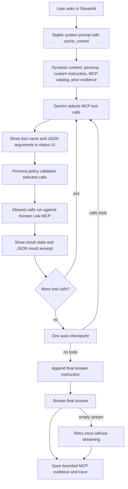
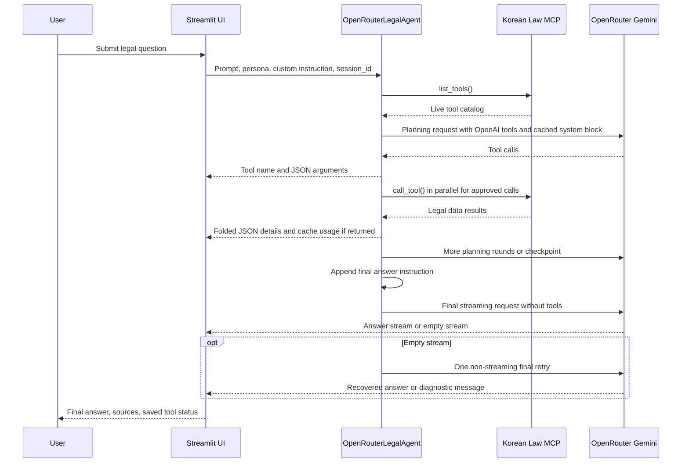

# Korean Law RAG Chatbot

Manual evaluation note: `tests/03-answer.md` is the reference answer for sample query 03, and `tests/03-eval.md` is a yes/no rubric for quickly judging another chatbot answer against that reference. This is a manual demo check, not automated test code.

Streamlit demo chatbot for Korean legal data. It uses OpenRouter Gemini 3.5 Flash, OpenAI SDK tool calling, and a local Korean Law MCP server.

## What It Does

- Multi-turn legal chat with streaming answers.
- Calls Korean Law MCP tools every turn, without web search.
- Shows tool names, arguments, and result excerpts in Streamlit status UI as JSON.
- Keeps large status JSON folded under `JSON details`.
- Preserves recent MCP evidence for follow-up questions.
- Compacts older MCP evidence so long chats stay bounded.
- Uses an OpenRouter session id and Gemini cache hints for better prompt-cache reuse.
- Runs up to 10 tool-calling/planning iterations by default.
- Writes local debug logs to `logs/chatbot-debug.log`.
- Supports two personas:
  - `general`: accessible answers, law text first.
  - `tax_accountant`: professional tax context, with specialist sources when useful.

## Flow



## Sequence



## Setup

Install Python dependencies:

```bash
uv sync
```

Prepare Korean Law MCP:

```bash
cd ../korean-law-mcp
npm install
npm run build
```

Create `.env`:

```bash
cp .env.sample .env
```

Required values:

```bash
OPENROUTER_API_KEY=...
MCP_API_KEY=...
```

Tuned defaults already applied by the app:

```bash
KOREAN_LAW_MCP_DIR=../korean-law-mcp
RECENT_TOOL_CONTEXT_TURNS=2
MAX_TOOL_EVIDENCE_CHARS=6000
MAX_COMPACTED_EVIDENCE_CHARS=12000
MAX_TOOL_ROUNDS=10
LOG_LEVEL=INFO
LOG_FILE=logs/chatbot-debug.log
```

Set these only when you want to override the defaults.
`MCP_API_KEY` is the 법제처 key. The app passes it to Korean Law MCP as `LAW_OC`.
Prefix caching is always enabled in code through the stable system prompt `cache_control` block and a per-session OpenRouter `session_id`.
`MAX_TOOL_ROUNDS` controls the maximum number of LLM planning/tool-calling iterations; the default is 10.

## Run

```bash
uv run streamlit run main.py --server.port 8507
```

Streamlit uses `watchdog` for local file watching through `.streamlit/config.toml`.

## Key Files

- `main.py`: small Streamlit entrypoint.
- `app/ui.py`: chat UI, status containers, JSON trace rendering.
- `app/llm.py`: OpenAI SDK tool loop, session id, cache hints, evidence memory.
- `app/models.py`: Pydantic models for messages, traces, and MCP evidence.
- `app/mcp_client.py`: starts Korean Law MCP and calls MCP tools.
- `app/observability.py`: configures local Loguru file logging.
- `app/permissions.py`: general vs tax-accountant source scope.
- `prompts/*.j2`: stable system prompt and runtime prompt injections.
- `MCP.md`: compact Korean Law MCP notes.
- `tests/*.md`: sample legal/tax questions you can paste into the chatbot manually.
- `plan.md`: current plan and assumptions.

## Verify

```bash
uv run python -m py_compile main.py app/*.py
uv run python -c "import watchdog; print('watchdog installed')"
uv run streamlit config show | rg "fileWatcherType|watchdog"
```

For runtime debugging, inspect `logs/chatbot-debug.log`.
